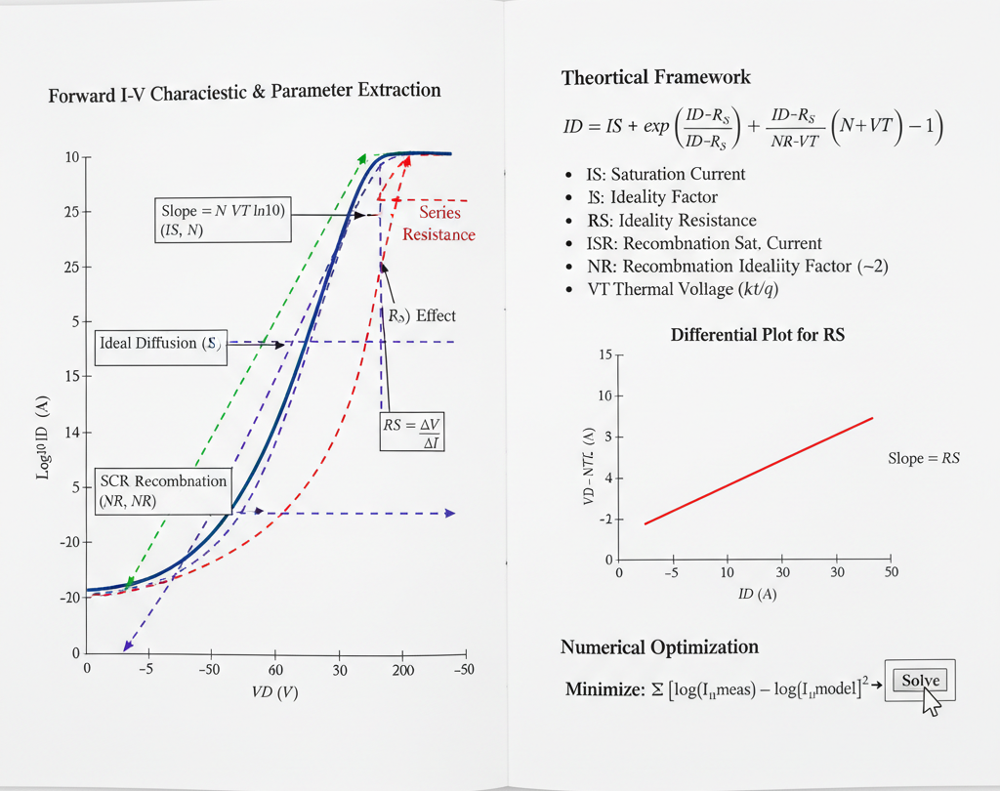

## Theory
**Introduction:**  
The primary goal of parameter extraction is to find the values for a set of model parameters that allow the SPICE (Simulation Program with Integrated Circuit Emphasis) equations to accurately replicate the measured current-voltage (I-V) data of a real diode.

      
      
<strong>Fig. 1. Methods for Diode SPICE Parameter Extraction from Forward I-V Characteristics</strong>

### The SPICE Diode Model for Forward Bias

For the forward-bias DC characteristic, the total applied voltage ($V_D$) across the diode's terminals is the sum of the voltage across the internal ideal p-n junction ($V_j$) and the voltage dropped across the parasitic series resistance ($V_{RS}$).

$$V_D = V_j + V_{RS} = V_j + I_D \cdot RS$$

The current ($I_D$) flowing through the diode is described by a modified version of the Shockley equation. The most critical SPICE parameters to extract for the forward I-V curve are:

* **$IS$ (Saturation Current):** The theoretical reverse-bias saturation current, primarily due to diffusion.
* **$N$ (Ideality Factor):** An empirical parameter (also called the emission coefficient) that accounts for the dominant current mechanism. $N \approx 1$ for ideal diffusion, and $N \approx 2$ for space-charge region recombination.
* **$RS$ (Series Resistance):** The parasitic ohmic resistance from the semiconductor bulk material, metal contacts, and package leads.

More advanced models also include parameters for low-current and high-current non-idealities:

* **$ISR$ (Recombination Saturation Current):** A separate saturation current for the non-ideal recombination component that dominates at low bias.
* **$NR$ (Recombination Ideality Factor):** The ideality factor for $ISR$, typically fixed at 2.
* **$IKF$ (High-Injection Knee Current):** The forward current at which high-level injection effects become significant, causing the ideality factor to increase.

---

### I-V Curve Regions and Parameter Dominance

A typical diode forward I-V curve, when plotted on a semi-log scale ($log(I_D)$ vs. $V_D$), can be divided into three distinct regions, each dominated by different physical effects and parameters.

1.  **Low-Current Region (Recombination-Dominated):**
    * At very low forward voltages, the current is dominated by the recombination of electrons and holes within the space-charge region.
    * This current is modeled using the $ISR$ and $NR$ parameters, and the curve has a slope corresponding to an ideality factor $N \approx 2$.

2.  **Mid-Current Region (Diffusion-Dominated):**
    * As the voltage increases, the ideal diffusion current (modeled by $IS$ and $N$) becomes dominant.
    * On the $log(I_D)$ vs. $V_D$ plot, this region appears as a straight line.
    * The behavior here is described by the ideal Shockley equation: $I_D \approx IS \cdot e^{\frac{V_j}{N \cdot V_T}}$.
    * $V_T$ is the thermal voltage, $kT/q$, which is $\approx 25.9 \text{ mV}$ at 300K (room temperature).

3.  **High-Current Region (Series Resistance & High-Injection):**
    * At high forward voltages, two effects become dominant:
        * **Series Resistance ($RS$):** The voltage drop across $RS$ ($I_D \cdot RS$) becomes a significant portion of the total applied voltage $V_D$. This "robs" the internal junction of voltage, causing the $log(I_D)$ curve to bend and "roll off" from its straight-line path.
        * **High-Level Injection ($IKF$):** The concentration of injected minority carriers approaches the majority carrier doping concentration. This effect also causes the curve to bend (ideality factor trends towards 2).

---

### Graphical Extraction Methods

The simplest extraction techniques rely on analyzing the $log(I_D)$ vs. $V_D$ plot in these distinct regions.

#### 1. Extracting $N$ (Ideality Factor) and $IS$ (Saturation Current)

These parameters are extracted from the **linear mid-current region** of the $log(I_D)$ vs. $V_D$ plot.

* **Ideality Factor ($N$):** The slope of this linear region is used to find $N$. From the diode equation, we can write:
    $$log(I_D) = log(IS) + \frac{V_j}{N \cdot V_T}$$
    Assuming $V_j \approx V_D$ in this region (where $RS$ effects are small) and using $log_{10}$, the slope is:
    $$\text{Slope} = \frac{\Delta log_{10}(I_D)}{\Delta V_D} = \frac{1}{N \cdot V_T \cdot ln(10)}$$
    By measuring the slope from the graph and knowing $V_T$, we can solve for $N$:
    $$N = \frac{1}{\text{Slope} \cdot V_T \cdot ln(10)}$$

* **Saturation Current ($IS$):** Once $N$ is known, $IS$ can be found by extrapolating the linear mid-current region back to the $V_D = 0$ axis.
    * The y-intercept of this extrapolated line is $log_{10}(IS)$.
    * Therefore, **$IS = 10^{\text{intercept}}$**.

#### 2. Extracting $RS$ (Series Resistance)

$RS$ is extracted from the **high-current region** where the curve deviates from the ideal straight line.

* **Method 1: High-Current Slope (Approximation)**
    At very high currents, the device behaves more like a resistor. The dynamic resistance $r_d = dV_D / dI_D$ is measured from the linear I-V plot (not the log plot) at the highest current. This dynamic resistance approaches the series resistance:
    $$r_d = \frac{dV_D}{dI_D} \approx RS$$

* **Method 2: Voltage Difference**
    Pick a point ($V_{D, high}, I_{D, high}$) in the high-current region. Find the corresponding voltage $V_{ideal}$ on the extrapolated ideal line (from the mid-current region) for the same current $I_{D, high}$. The difference between these voltages is the drop across $RS$.
    $$V_{RS} = V_{D, high} - V_{ideal} = I_{D, high} \cdot RS$$
    Therefore, **$RS = (V_{D, high} - V_{ideal}) / I_{D, high}$**.

* **Method 3: Differential Plot (Advanced)**
    A more robust method is to plot a function like $H(I_D) = V_D - N \cdot V_T \cdot ln(I_D / IS)$ vs. $I_D$, using the $N$ and $IS$ found earlier. This plot should ideally be a straight line with a slope equal to $RS$.

---

### Numerical Optimization (Curve Fitting)

Graphical methods are simple but have limitations, as the parameters are not truly independent. The modern and most accurate approach is **numerical optimization**.

1.  **Define a Model:** The full SPICE equation is used, combining all parameters:
    $$I_D = IS \cdot \left(e^{\frac{V_D - I_D \cdot RS}{N \cdot V_T}} - 1\right) + ISR \cdot \left(e^{\frac{V_D - I_D \cdot RS}{NR \cdot V_T}} - 1\right)$$
    (This is a simplified representation; the full model also includes $IKF$).

2.  **Define an Error Function:** An error function (e.g., sum of squared errors) is defined to quantify the difference between the measured current ($I_{meas}$) and the calculated model current ($I_{model}$) at each measured voltage point $V_D$.
    $$\text{Error} = \sum_{i} \left[ \log(I_{meas, i}) - \log(I_{model}(V_{D, i}, IS, N, RS, ...)) \right]^2$$
    (Fitting the log of the current is common to give equal weight to all current decades).

3.  **Optimize:** A numerical algorithm (like Levenberg-Marquardt) iteratively adjusts the parameters ($IS$, $N$, $RS$, etc.) to **minimize the total error**. This "best-fit" set of parameters is the one that makes the model equation most closely match the real-world data across the entire I-V curve.

     
 
